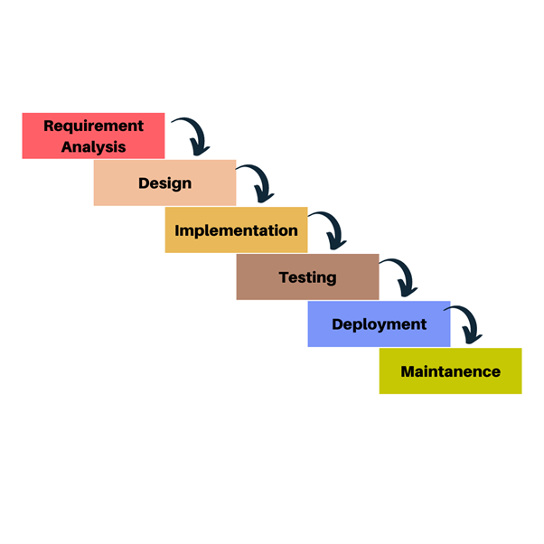
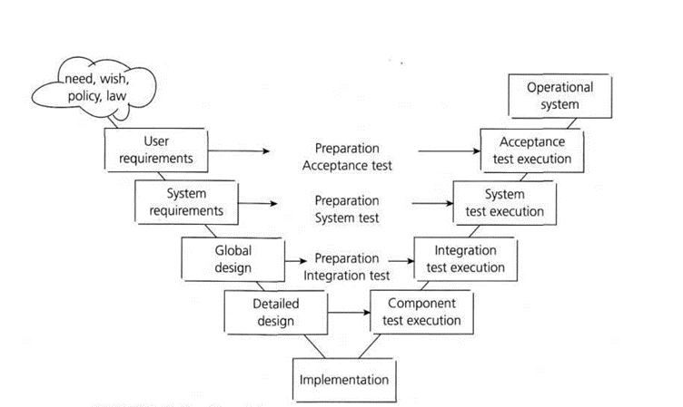
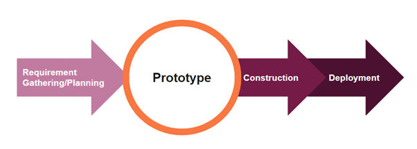
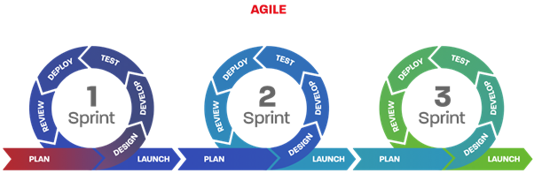

## 1. SDLC Phases:

### 1.1 Requirements Gathering:
- Involves collecting and documenting user requirements for the software.
- Focuses on understanding the needs, objectives, and functionalities expected from the software.

### 1.2 Design:
- Involves creating the architectural, functional, and technical design of the software based on the gathered requirements.
- Determines the overall structure, components, and interfaces of the software system.

### 1.3 Coding:
- Implementation of the software design using programming languages and development tools.
- Developers write code and create the actual software product.

### 1.4 Testing:
- Involves the verification and validation of the software to ensure it meets the specified requirements and quality standards.
- Different testing techniques and methodologies are used to identify and fix defects.

### 1.5 Deployment:
- The software is deployed or released to the end-users or customers.
- It includes activities like installation, configuration, and data migration.

### 1.6 Maintenance:
- Involves ongoing support and enhancements of the software after its deployment.
- Bug fixes, updates, and improvements are made based on user feedback and changing requirements.

## 2. SDLC Models:

### 2.1 Waterfall Model:
- Sequential and linear approach to software development.
- Phases (requirements, design, coding, testing, deployment, maintenance) are followed in a linear manner.
- Each phase must be completed before moving to the next.
- Suitable for projects with well-defined and stable requirements.

### 2.2 V Model:
- Extension of the waterfall model that emphasizes testing and verification.
- Testing activities are aligned with each phase of the development process.
- Testing is performed at each stage to ensure quality and compliance with requirements.
- Enhances the testing process by early identification of defects.

### 2.3 RAD (Rapid Application Development):
- Focuses on rapid prototyping and iterative development.
- Emphasizes user involvement and feedback throughout the development process.
- Suitable for projects with rapidly changing requirements and tight schedules.
- Promotes collaborative development and reduces the time-to-market.

### 2.4 Agile:
- Iterative and incremental approach to software development.
- Emphasizes flexibility, adaptability, and customer collaboration.
- Development is divided into short iterations called sprints.
- Regular feedback and continuous improvement are key principles.
- Popular agile frameworks include Scrum and Kanban.

- 